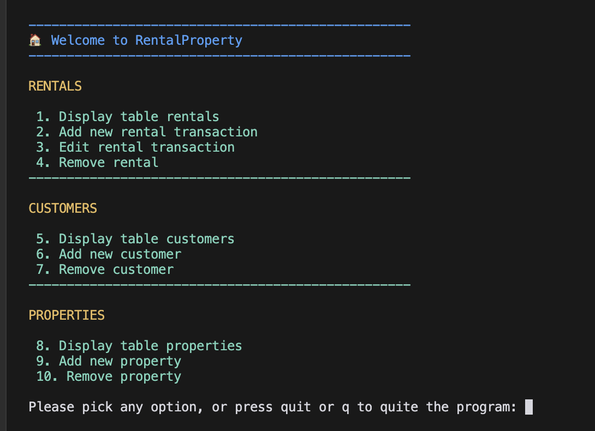
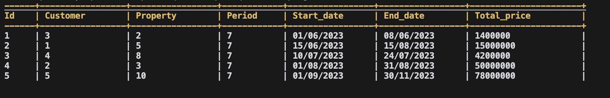
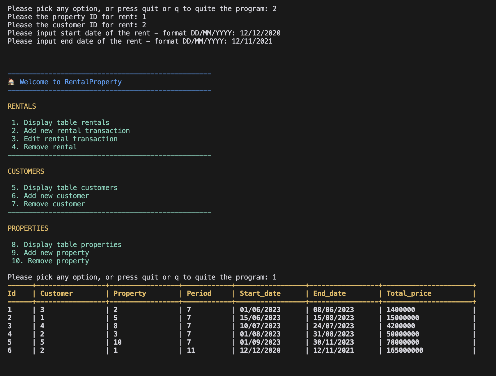

# 🏘️  Welcome to RentalProperty v0.1

## A simple property rental app in Python console

### Features
1. CRUD app to manage `rentals` transactions
2. Manage CRD operations (create, read, delete) for `customers` and `properties` data
3. Robust app design with multiple validations on input data
4. Use JSON files as persistent database (for now)
5. Try to adhere to domain-driven clean architecture for project structure (as could as possible)
6. Colorful console output


### Tech stack (and details)
1. Python
2. Simple setup for new developer onboarding, i.e. `Makefile`
3. Standard libraries:
    * `datetime`  - to calculate period and datetime related operations
    * `os` - file IO operations (read and write JSON files)
    * `re` - regex matching for date format

4. External dependencies:
    * `colorama` - to provide colorful console output 🚀

### Output screenshots

#### Main menu


#### Table format (self implemented)


#### Add new rental



### Run the project
```bash
makefile venv
```

You're good to go now  🚀